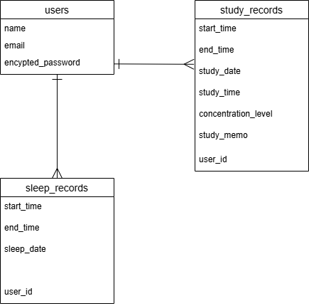
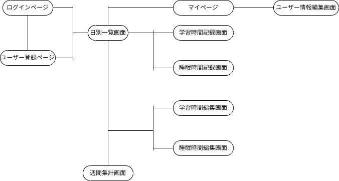

# アプリケーション名

SSRecord

# アプリケーション概要

睡眠時間と学習時間を記録し、日別・週別に振り返ることで、生活リズムの改善を支援する

# URL

https://ssrecord-42059-rails7-user-id.onrender.com/

# 利用方法

## 睡眠・学習時間記録

1. ログイン画面からログインする。ユーザー登録していない場合はログイン画面から新規登録画面にアクセスし、ユーザー新規登録を行う
2. ログイン中に表示されるヘッダーから睡眠時間または学習時間登録画面にアクセスする
3. 就寝時・学習開始時の日時を登録する
4. 起床・学習終了した際には日別一覧画面から就寝・学習開始時の記録のカードの編集ボタンをクリックし、編集画面にアクセスして起床・学習終了時刻を登録する

### 備考

- 学習時間記録に関しては開始日時と終了時刻に加え、学習内容のメモを記録できる
- 学習時間記録および睡眠時間記録はそれぞれ1日に1件までしか登録できない
- 睡眠時間記録は就寝時刻が0:00～5:00の場合、前日の記録として扱う
- 学習時間記録の開始日時および終了時刻は9:00～18:00の範囲で登録しなければならない
- 睡眠時間記録は起床時刻を登録する場合、睡眠時間が30分以上14時間以下となるように登録しなければならない
- 学習時間記録および睡眠時間記録はそれぞれ学習終了時刻と起床時刻が登録済みの場合、未完了の状態に変更することはできない

# アプリケーションを制作した背景

私はGoogleスプレッドシートに学習時間・睡眠時間を記録しているが、記録する際の手間から少なくない頻度で記録し忘れることがあった。<br>
また、「睡眠時間が短い日に学習効率が下がっていないか」「生活リズムの乱れが学習習慣に影響していないか」といったように両者を関連付けた振り返りを行いづらく感じていた。<br>
そこで、自分のように生活リズム管理や学習習慣の維持に課題を感じている人に向けて、睡眠時間と学習時間をまとめて簡単に記録・振り返りできるアプリケーションを制作することにした。

# 実装予定の機能

- 学習時間記録に1～5の5段階評価で集中度の記録（デフォルト/評価なしは0）
- 学習時間記録と睡眠時間記録に対する目標時間記録機能
- ログイン中のユーザー情報の編集機能
- カレンダー表示およびカレンダーから選択する形式での特定日付に絞った日別表示機能
- 週間集計画面における睡眠時間と学習時間のグラフ表示
- 同一日付における複数の学習時間記録の登録機能
- 前日の学習時間記録と睡眠時間記録が未登録・未完了の場合に通知するよう設定できるリマインダー機能

# 画面画像

## トップページ(日別一覧画面)

[](https://gyazo.com/9526e31b90dab4396066595a28243f45)

睡眠時間・学習時間の記録の一覧を日別に表示する。<br>
日別一覧画面では、睡眠時間・学習時間の記録の編集や、週間集計画面への遷移ができる。<br>
日別一覧画面では、就寝・学習開始日時が0:00～5:00の場合、前日の記録として扱うため、日付の表示は就寝・学習開始日時が0:00～5:00の場合、前日の日付を表示する<br>
同一日付の記録内容をまとめて表示することで、睡眠時間と学習時間の関連性を振り返りやすくした

## 睡眠時間登録画面

[](https://gyazo.com/fe7311af5bcacfb3d5dfae5af15acd3b)

[](https://gyazo.com/6d9d52eb3fb12dd9c928225633c0b67f)

就寝日時と起床時刻を登録できる。<br>
深夜に就寝した場合でも実際の生活感覚に近づけるため、就寝日時が0:00～5:00の場合、前日の記録として扱うよう設定した。<br>
記録時には就寝日時のみを必須項目とし、起床日時は後から登録できるようにしている。<br>
実際の生活感覚に近づけて継続した記録の習慣づけを行いやすくするため、起床時間に関しては日時ではなく時刻のみを入力する形にし、就寝日時の日付部分を起床日時に自動で反映させるようにしている。

## 学習時間登録画面

[](https://gyazo.com/d3684528bfb15ee0de47b10f3599c51c)

[](https://gyazo.com/82c11e4cd0dafcd2571e2c6b7019ffc8)

学習開始時間と学習終了時間、学習内容のメモを登録できる。<br>
学習開始日時と学習終了日時は9:00～18:00の範囲で登録するようにしている。<br>
記録時には学習開始日時のみを必須項目とし、学習終了日時は後から登録できるようにしている。<br>
また、学習内容のメモに関しても任意とし、後から登録・編集できるようにしている。<br>
学習開始日時と学習終了日時は日時ではなく時刻のみを入力する形にし、学習開始日時の日付部分を学習終了日時に自動で反映させるようにしている。

# データベース設計



# 画面遷移図



# 開発環境

## 使用技術

- RUby 3.2.x
- Ruby on Rails 7.1.x
- MySQL 8.0.x
- PostgreSQL 14.x
- HTML
- SCSS
- JavaScript
- Bootstrap 5.3.x

### 補足

- データベースは開発・テスト環境ではMySQLを使用し、本番環境ではPostgreSQLを使用する
- デプロイ先のレンダリングサービスがPostgreSQLを使用しているため
- データベースの違いによる影響を最小限にするため、MySQLとPostgreSQLの両方で動作確認を行う

## 開発環境

- WSL2 (Ubuntu 24.04.4 LTS)
- Visual Studio Code
- Git / GitHub
- Render

## 使用gem

- devise
- dartsass-rails
- bootstrap
- rspec-rails
- factory_bot_rails
- faker
- rails-i18n

# ローカルでの動作方法

1. GitHubからリポジトリをクローンする

```bash
git clone https://github.com/YK1217/ssrecord-42059.git
```

2. ターミナルでプロジェクトのルートディレクトリに移動する

```bash
cd ssrecord-42059
```

3. 必要なgemおよびJavaScriptパッケージをインストールする

```bash
bundle install
yarn install
```

4. 環境変数を設定する

```bash
export BASIC_DB_USER="MySQLのユーザー名"
export BASIC_DB_PASSWORD="MySQLのパスワード"
export TEST_PASSWORD="テストログイン用ユーザーのパスワード"
```

5. データベースを作成してマイグレーションを行い、初期データを投入する

```bash
rails db:create
rails db:migrate
rails db:seed
```

`rails db:seed`を実行すると、以下のテストログイン用ユーザーが作成される。

メールアドレス: test@example.ne.jp<br>
パスワード: TEST_PASSWORDに設定した値

6. ローカルサーバーを起動する

```bash
bin/dev
```

7. ブラウザで http://localhost:3000 にアクセスする

## 補足

- bootstrapおよびdartsass-railsを使用しているため、ローカルサーバーは`bin/dev`コマンドで起動する必要がある
- `TEST_PASSWORD`を設定せずに`rails db:seed`を実行すると、テストログイン用ユーザーの作成に失敗する。
- また、`TEST_PASSWORD`は英数字を各1文字以上含む8文字以上の値に設定する必要がある。これらの条件を満たさない値を`TEST_PASSWORD`に設定している場合も、テストログイン用ユーザーの作成に失敗する。

## テストコードの実行コマンド

```bash
bundle exec rspec spec/models
bundle exec rspec spec/system
```
